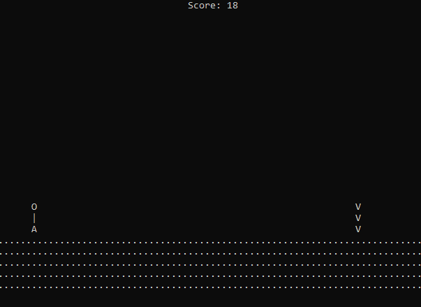

  

 

# *How long can you go?*
A simple Window's commandline game where you need to jump over the obstacles.

# Sample Gameplay

# Prerequisites
Use Windows Console Host as Default Terminal Application for best results
